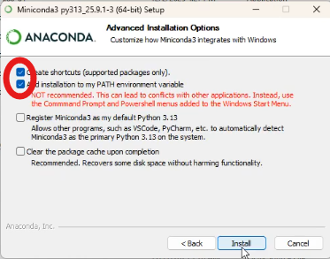

# FERPA Waiver PDF Merger

A tool for merging student FERPA waiver PDFs for Emerald Youth Foundation. Includes both a command-line interface and a user-friendly web interface.

---

## Quick Start (Web Interface)

The easiest way to use this tool is through the web interface:

```bash
# After setup (see below), run:
streamlit run app.py
```

This opens a browser at **http://localhost:8501** with a simple 4-step workflow:

1. **Upload Excel file** - Upload your spreadsheet with student EYF IDs (must have an "EYFID" column)
2. **Upload PDF waivers** - Drag and drop all your waiver PDF files
3. **Review matches** - See which students matched, which are missing waivers, and any duplicates
4. **Download** - Get your merged PDF and a status report of missing waivers

### File Naming Convention

Waiver PDFs should be named starting with the EYF ID:
```
{EYFID}_{Student Name}_KCS Records Consent_{...}.pdf
```
Example: `12345_John Doe_KCS Records Consent_form_01012025.pdf`

---

## Command Line Usage

For advanced users, you can also use the command line:

```bash
python generate_pdf_request.py <waiver_folder> <excel_file> <output_file>
```

Example:
```bash
python generate_pdf_request.py ./waivers KCSDataRequest_EYF2425SubmissionExample.xlsx merged_waivers.pdf
```

---

# Conda Environment Setup

This project uses a custom conda environment with all required dependencies.

## Conda Installation


1. Download Miniconda from [here](https://www.anaconda.com/download)
2. Run the installer
3. When installing, check the option to "Add installation to my PATH environment variable"



## Environment Name

`emerald-youth-hack`

## Dependencies Included

- **Python 3.12**
- **streamlit** (>=1.28.0) - Web interface framework
- **pandas** (>=2.0.0) - Data manipulation
- **openpyxl** (>=3.1.0) - Excel file reading
- **pypdf** (>=6.0.0) - PDF manipulation library
- **reportlab** (>=4.0.0) - PDF generation library
- **pytest** (>=7.0.0) - Testing framework

## One-time setup

Paste these commands into your terminal

```bash
conda init powershell
conda env create -f environment.yml
conda activate emerald-youth-hack
```

## Deactivating the Environment

```bash
conda deactivate
```

## Running Your Code

```bash
# Activate environment first (if a different environment has been activated since the one time setup)
conda activate emerald-youth-hack

# Then run the script
python generate_pdf_request.py <waiver_folder_path> <excel_file> <output_file_name>
```

## Updating the Environment

If you add new dependencies, update `environment.yml` and then:

```bash
conda env update -f environment.yml --prune
```

## Verifying Installation

To verify all packages are installed correctly:

```bash
conda activate emerald-youth-hack
python -c "import pypdf; import reportlab; import pytest; print('All dependencies OK!')"
```
